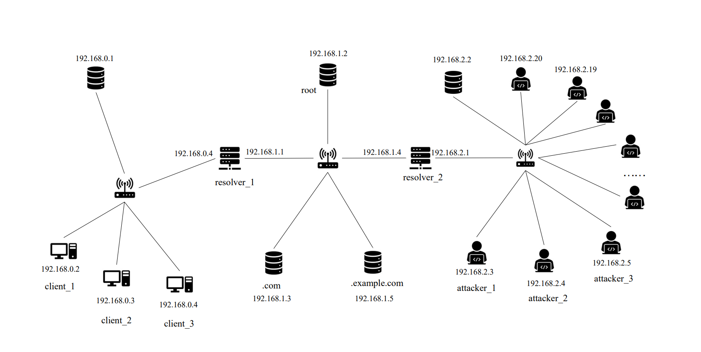

## DNS反射/放大攻击靶场

> 参考项目[dns-cyber-range](https://gitee.com/duguxt/dns-cyber-range)

使用docker、containerlab等轻量级虚拟化和虚拟网络构建工具，实现拓扑可定义、节点规模可扩展的DNS反射/放大攻击靶场，支持攻击模拟和吞吐量分析

请先自行安装[containerlab](https://containerlab.dev/install/)


### 拉取镜像（或手动在本地构建）

```bash
sudo ./pull_images.sh
```

### 部署网络



1. 配置网桥

```bash
sudo ./config.sh
```

2. 部署网络拓扑（部署完便可开始模拟攻击）

```bash
sudo ./deploy.sh
```


3. 删除拓扑（模拟完攻击后进行的操作）

```bash
sudo ./destroy.sh
```

4. 其他

- 查看网络拓扑

```bash
sudo ./inspect.sh
```

- 进入节点（可交互）

```bash
sudo ./node.sh [容器id或名字]
```

### 模拟攻击

该攻击过程使用`iperf`来测量网络带宽，所以需要在受害者`client_1`上启动iperf服务器，然后在`client_2`上启动iperf客户端向`client_1`发送tcp报文。

- 默认攻击节点为`20`个，可以自行在`topo.yml`中添加节点
- 在`attack.sh`指定受害者节点，查询的dns服务器，以及DNS报文类型（默认受害者节点为`192.168.0.2`，查询的dns服务器为`192.168.2.1`）

#### 测量攻击前的带宽

```bash
sudo ./iperf_s.sh
```

```bash
sudo ./iperf_c.sh
```

记录当前的带宽值`bw1`

#### 模拟dns反射放大攻击

```bash
sudo ./attack.sh
```

#### 测量攻击后的带宽

```bash
sudo ./iperf_c.sh
```

记录当前的带宽值`bw2`，比较`bw1`和`bw2`

#### 停止攻击

```bash
sudo ./clean.sh
```

#### 查询流量（受害者主机上）

```bash
sudo ./tcpdump_client.sh
```
